<div align="center">


</div>

<br />



<br />

<details>
<summary><b>📺 TERMINAL // ACCESS_BIO [Click to Expand]</b></summary>
<br/>

```mermaid
%%{init: {'theme': 'dark', 'themeVariables': { 'primaryColor': '#00E5FF', 'edgeLabelBackground':'#0d1117', 'tertiaryColor': '#0d1117'}} }%%
classDiagram
    class YashAbhichandani {
        +String Role "Full-Stack Engineer"
        +String Location "The Cloud"
        +String Passion "Formula 1 🏎️"
        +Code()
        +Deploy()
        +Win()
    }
    class TechStack {
        +Frontend "Next.js / React"
        +Backend "FastAPI / Python"
        +Database "Supabase / SQL"
    }
    class Mission {
        +Goal "Build the Future"
        +Status "In Progress"
    }
    YashAbhichandani --|> TechStack : Masters
    YashAbhichandani ..> Mission : Executes
```

```bash
yash@mainframe:~$ whoami
> Yash Abhichandani. Full-Stack Developer. F1 Fanatic.
> I turn caffeine into fast, scalable code.

yash@mainframe:~$ cat current_status.json
{
  "focus": "F1-Predictor Vibe Project",
  "status": "Shipping",
  "mood": "Full Beans",
  "music": "Synthwave"
}

yash@mainframe:~$ ./contact.sh
> GitHub: @Abhichandani-Yash-Manish
> LinkedIn: Connected
> Email: yashraj2507@gmail.com
```

</details>

---

### 🚀 EXECUTION_PROTOCOL // WORKFLOW

```mermaid
sequenceDiagram
    participant User
    participant Yash
    participant Code
    participant Deploy

    User->>Yash: "I have a complex idea..."
    Yash->>Yash: Brainstorm & Design 🧠
    Yash->>Code: Coding "Full Beans" mode ⚡
    Code-->>Deploy: Push to Production 🚀
    Deploy-->>User: "Here is your masterpiece."
```



---

### � SYSTEM_MODULES // TECH_STACK

<div align="center">

| **Frontend (Interface)** | **Backend (Core)** | **DevOps (Deployment)** |
|:---:|:---:|:---:|
|  |  |  |

</div>

---

### 📊 TELEMETRY_DATA // STATS_&_HEATMAP

<div align="center">


<br/>
<br/>

<!-- Contribution Graph (Heatmap) -->


</div>

---

### 📂 MISSION_LOGS // PROJECT_DATABASE

| ID | Mission Name | Class | Status | Access |
|:--:|:--|:--:|:--:|:--:|
| `001` | **F1 Predictor** | *Flagship* | `ACTIVE` 🟢 | [**[DEPLOY]**](https://apexpredict.live) |
| `002` | **System Portfolio** | *Identity* | `STABLE` 🔵 | [**[ROOT]**](https://github.com/Abhichandani-Yash-Manish) |
| `003` | **Secret Project** | *R&D* | `CLASSIFIED` 🔴 | `[DENIED]` |

---

<div align="center">
  <code> END_OF_TRANSMISSION // 2026 </code>
</div>
